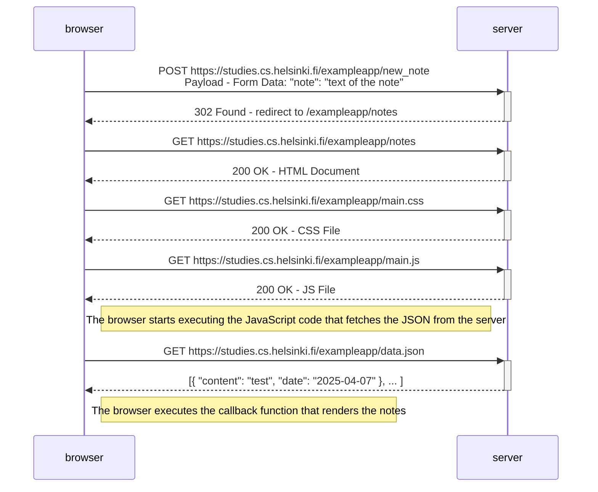

```mermaid
sequenceDiagram
    participant browser
    participant server

    browser->>+server: POST https://studies.cs.helsinki.fi/exampleapp/new_note <br/> Payload - Form Data: "note": "text of the note"
    server-->>-browser: 302 Found - redirect to /exampleapp/notes

    browser->>+server: GET https://studies.cs.helsinki.fi/exampleapp/notes
    server-->>-browser: 200 OK - HTML Document


    browser->>+server: GET https://studies.cs.helsinki.fi/exampleapp/main.css
    server-->>-browser: 200 OK - CSS File

    browser->>+server: GET https://studies.cs.helsinki.fi/exampleapp/main.js
    server-->>-browser: 200 OK - JS File

    Note right of browser: The browser starts executing the JavaScript code that fetches the JSON from the server

    browser->>+server: GET https://studies.cs.helsinki.fi/exampleapp/data.json
    server-->>-browser: [{ "content": "test", "date": "2025-04-07" }, ... ]

    Note right of browser: The browser executes the callback function that renders the notes
```