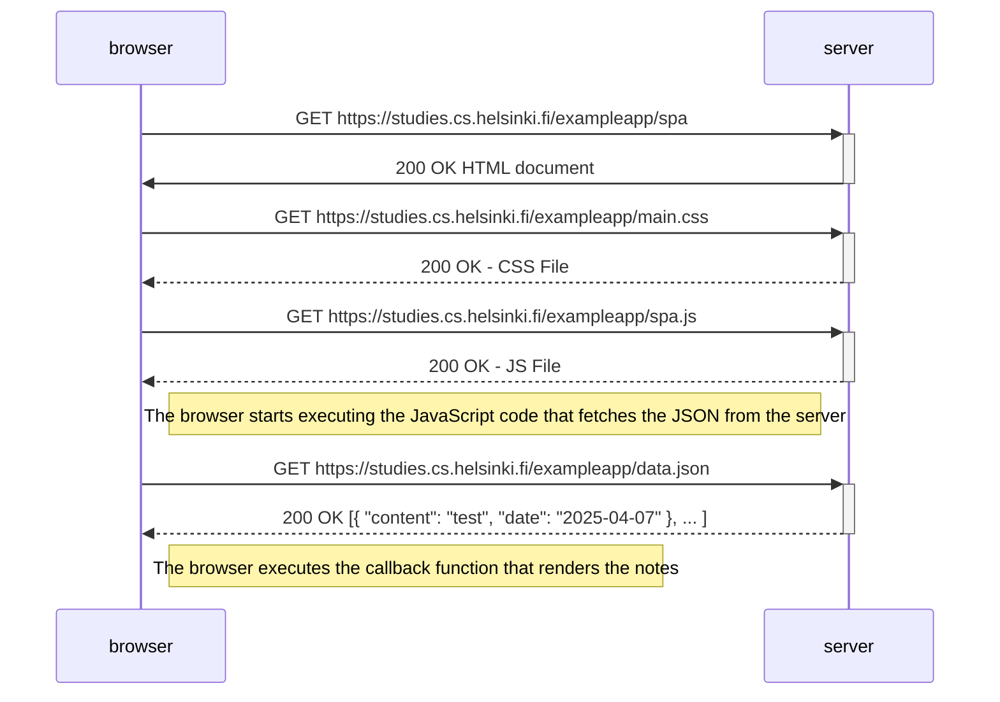

```mermaid
sequenceDiagram
    participant browser
    participant server

    browser->>+server: GET https://studies.cs.helsinki.fi/exampleapp/spa
    server->>-browser: 200 OK HTML document

    browser->>+server: GET https://studies.cs.helsinki.fi/exampleapp/main.css
    server-->>-browser: 200 OK - CSS File

    browser->>+server: GET https://studies.cs.helsinki.fi/exampleapp/spa.js
    server-->>-browser: 200 OK - JS File

    Note right of browser: The browser starts executing the JavaScript code that fetches the JSON from the server

    browser->>+server: GET https://studies.cs.helsinki.fi/exampleapp/data.json
    server-->>-browser: 200 OK [{ "content": "test", "date": "2025-04-07" }, ... ]

    Note right of browser: The browser executes the callback function that renders the notes
    
```